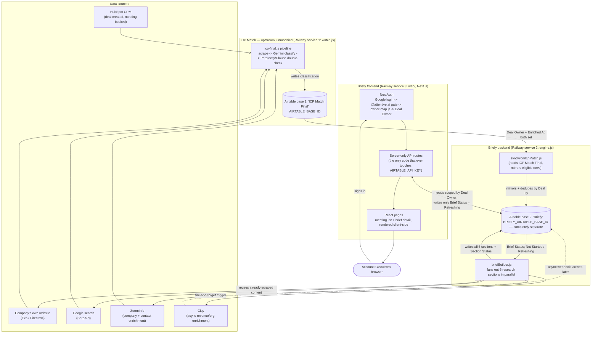
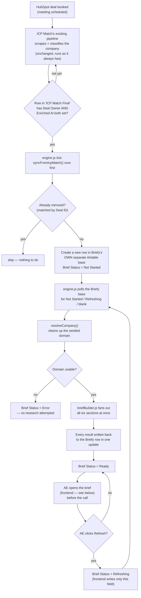
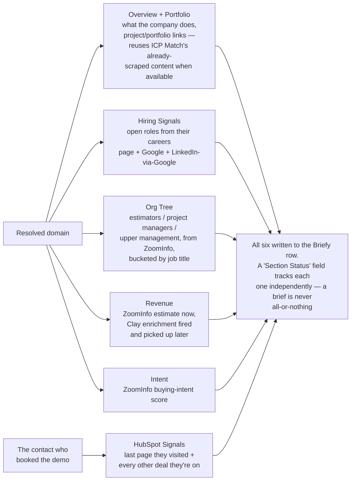
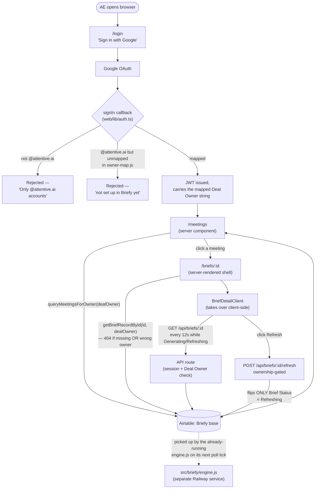
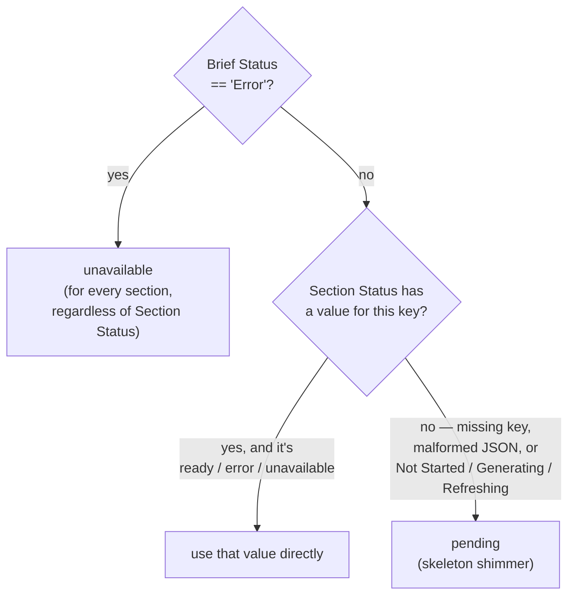
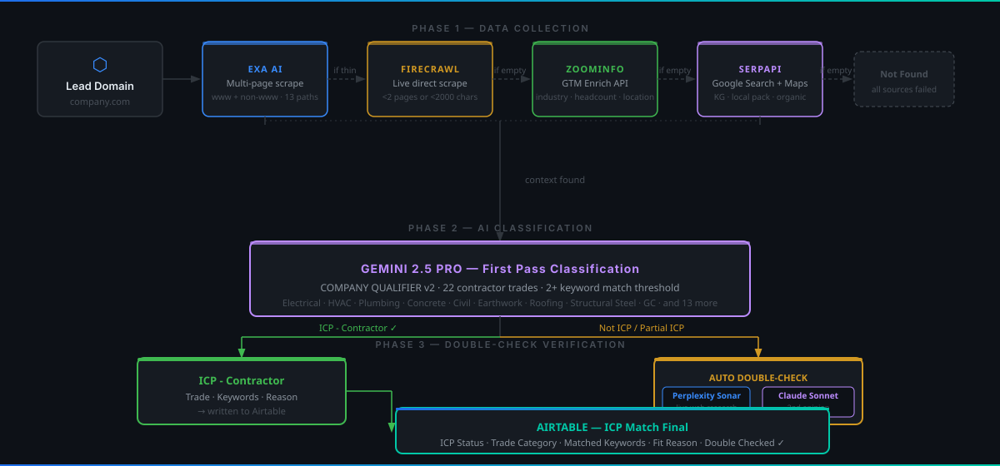

<div align="center">

  <a href="https://github.com/shashankbhardwaj05/briefy-final"></a>
  
  
  
  
  

</div>

---

# Briefy — Pre-Call Briefing Agent for Account Executives

Every time a meeting gets booked, an Account Executive at Attentive.ai has to walk in
cold — or spend 10 minutes before the call scrambling across HubSpot, ZoomInfo,
Google, and the company's own website. **Briefy does that research automatically**,
the moment the deal has an owner, and has a finished brief sitting ready before the
AE ever opens the app: company overview, org chart, hiring signals, revenue, buying
intent, and their own HubSpot engagement history with that specific person — six
independent research sections, fanned out in parallel, each with its own live status.

Each AE signs in with their `@attentive.ai` Google account and only ever sees briefs
for deals **they personally own** — enforced server-side, on every read.

> This repo also hosts **[ICP Match](#icp-match-the-upstream-engine)**, a separate,
> already-running product that automatically qualifies inbound leads against ibeam.ai's
> Ideal Customer Profile before an AE ever picks up the phone. Briefy was built
> *on top of* ICP Match's existing pipeline rather than duplicating it — see
> [System Overview](#system-overview) for exactly how the two connect. ICP Match runs
> completely unmodified by Briefy's presence.

<div align="center">

🧭 [System Overview](#system-overview) | 🏗️ [Backend Build](#backend-build-log) | 💻 [Frontend Build](#frontend-build-log) | 🗄️ [Airtable Schema](#airtable-schema) | ⚙️ [Setup](#setup) | 🚀 [Deploy](#deploy-to-railway) | 📁 [File Structure](#file-structure) | 🔍 [ICP Match](#icp-match-the-upstream-engine)

</div>

---

## System Overview

Briefy is deliberately **not** a fresh integration. It sits downstream of ICP Match's
existing HubSpot ↔ Airtable pipeline, reuses ICP Match's already-scraped website
content, and reuses its API clients (`src/lib/`) instead of rebuilding them. The whole
system spans **two separate Airtable bases**, **three always-on Railway services**,
and one Next.js app running in the AE's browser.

### Where data comes from, where it sits, how it's processed, and where it goes



### Where each kind of data actually lives

| Data | Lives in | Written by | Read by |
|---|---|---|---|
| Deal seed data + ICP classification | Airtable **"ICP Match Final"** (`AIRTABLE_BASE_ID`) | `icp-final.js` | `syncFromIcpMatch.js` — **read-only**, Briefy never writes here |
| Mirrored seed fields + all 6 research outputs + `Brief Status` / `Section Status` | Airtable **"Briefy"** table, its own separate base (`BRIEFY_AIRTABLE_BASE_ID`) | `syncFromIcpMatch.js`, `briefBuilder.js`, and the frontend's refresh route (only ever writes `Brief Status: "Refreshing"`) | The Next.js frontend, exclusively — server-side, never the browser directly |
| AE session (JWT: email + mapped Deal Owner) | The AE's browser cookie — no database, no server-side session store | NextAuth (`web/lib/auth.ts`) | `web/middleware.ts` and every server component/API route |
| AE login-email → HubSpot "Deal Owner" name mapping | `src/briefy/owner-map.js` — a plain, hand-maintained config file in the repo | You, manually | `resolveOwner()` during sign-in |
| API secrets (`AIRTABLE_API_KEY`, `HUBSPOT_API_KEY`, Google OAuth secret, etc.) | Environment variables only — Railway service variables in production, `.env`/`web/.env.local` locally | — | Only server-side code (`src/lib/`, `web/lib/`) — every file that reads a secret is guarded with `import 'server-only'` so a Client Component can't accidentally import it |

**The three hard isolation rules that hold across the entire system**, verified at
every review stage throughout the build:

1. **Two Airtable bases, never crossed.** Briefy only ever *reads* "ICP Match Final" —
   every write it makes lands in its own, separate base. ICP Match cannot see Briefy's
   base exists.
2. **`Deal Owner` string equality is the sole access-control mechanism.** Every read in
   the frontend — the meeting list, a single brief, the refresh action — filters or
   checks against the signed-in AE's mapped `Deal Owner`. A record belonging to a
   different AE is treated as **not found**, never as "forbidden" — it's
   indistinguishable from a record that doesn't exist at all.
3. **"Airtable is the trigger," always.** The frontend never calls the research engine
   directly. Clicking "Refresh" flips one field (`Brief Status: "Refreshing"`); the
   already-running `engine.js` daemon picks it up on its next poll. The frontend and
   the backend only ever talk to each other through Airtable rows, never a direct API
   call between them.

---

## Backend Build Log

> **Status: complete.** All 19 planned tasks built, individually reviewed, and passed
> a final whole-branch review (one Important robustness gap — missing request
> timeouts on a permanently-running daemon — was found and fixed). 55/55 tests
> passing. See [`BRIEFY_PROGRESS.md`](BRIEFY_PROGRESS.md) for the full task-by-task
> log and [`architecturefinal.md`](architecturefinal.md) for the exhaustive spec.

### The one thing that made this simple: no new integration

Early designs assumed Briefy would need its own HubSpot→Airtable workflow to create
its rows. It doesn't. ICP Match's pipeline is *already* creating and enriching a row
in Airtable ("ICP Match Final") for every relevant HubSpot deal. Briefy just watches
that same table for rows that are ready — meaning a `Deal Owner` has been assigned
**and** ICP Match's own research has actually finished — and copies each one into
Briefy's own, completely separate Airtable base.

### Milestone map

| # | Milestone | What it built |
|---|---|---|
| 1 | **Shared library foundation** (`src/lib/`) | Extracted scraping (Exa/Firecrawl/SerpAPI) and the LLM-gateway call out of `icp-final.js` into shared, reusable modules; extended the HubSpot/ZoomInfo clients; generalized the Airtable client to talk to two bases; added a Clay stub. Verified ICP Match's own behavior was completely unaffected. |
| 2 | **Briefy Airtable table** | An idempotent setup script that creates Briefy's 27-field table in its own base; `syncFromIcpMatch.js`, the piece that mirrors eligible "ICP Match Final" rows over — no second HubSpot integration needed. |
| 3 | **Company & contact resolution** | `resolveCompany.js` (domain cleanup) and the `owner-map.js` placeholder. Simplified mid-build once it became clear the seeded domain is always a single, already-resolved value — the originally-planned multi-company disambiguation logic was removed entirely as unreachable. |
| 4 | **Research sections — website & hiring** | Overview + Portfolio (reuses ICP Match's already-scraped content when available) and Hiring Signals (careers page + Google + LinkedIn-via-Google). |
| 5 | **Research sections — HubSpot, ZoomInfo, Clay** | Org Tree (ZoomInfo contacts bucketed by title — caught and fixed a real bug where "Director of Estimating" was miscategorized as a plain estimator), Revenue (ZoomInfo instant + Clay async), HubSpot Signals (last page visited + prior deals, resolved via the *contact*, not the company), Intent (ZoomInfo buying-intent score). |
| 6 | **Orchestration** | `briefBuilder.js` (fans out all six sections concurrently, writes one atomic update) and `engine.js` (the poll-loop daemon, modeled line-for-line on ICP Match's own `watch.js`). |
| — | **Final whole-branch review** | Found and fixed one Important gap: no external API call anywhere in the backend had a client-side timeout, and since the engine processes rows sequentially, one hung connection could stall the whole daemon indefinitely. Fixed across all 17 call sites in two rounds. |

### How a brief gets built, end to end



The whole cycle repeats every `BRIEFY_WATCH_INTERVAL_MIN` minutes (default 5),
forever — `engine.js` is deliberately modeled on ICP Match's `watch.js` line-for-line.

### The six research sections

Once a domain resolves, `briefBuilder.js` doesn't run these one after another — it
fires all six at once and writes the whole set back in one atomic update, so a brief
takes as long as its *slowest* section, not the sum of all six. Five sections research
the resolved **company domain**; one (HubSpot Signals) instead follows the **specific
person** who booked the demo.



| Section | What it answers for the AE | Source(s) |
|---|---|---|
| **Overview + Portfolio** | What does this company actually do, and what have they built? | Company's own site (Exa/Firecrawl) |
| **Hiring Signals** | Are they hiring estimators, PMs, or other relevant roles right now? | Careers page + Google + LinkedIn-via-Google |
| **Org Tree** | Who are the estimators, project/program managers, and upper management? | ZoomInfo contacts, bucketed by title |
| **Revenue** | Roughly how big is this company? | ZoomInfo (instant) + Clay (async, arrives later) |
| **HubSpot Signals** | What did this specific person look at, and are they talking to us elsewhere? | HubSpot (contact's page analytics + their other deals) |
| **Intent** | Are they actively researching solutions like ours right now? | ZoomInfo buying-intent topics |

### Backend key design points

- **One domain per deal, not a list.** The seeded domain is always a single,
  already-resolved value — `resolveCompany.js` is a small, synchronous string-cleanup
  function with zero network calls.
- **Prior deals resolve via the person, not the company** — find the contact who
  booked this specific demo, then list every *other* deal associated with that same
  person, with no "most relevant" filtering applied.
- **Clay is fire-and-forget.** `briefBuilder.js` triggers a Clay enrichment and moves
  on without waiting — `Revenue`'s Clay figure shows `"pending"` until Clay's own
  webhook lands later and updates the row directly.
- **Every external API call has a 20-second client-side timeout** — caught by the
  final whole-branch review, since `engine.js` processes rows one at a time and one
  hung connection would otherwise stall the daemon indefinitely.

---

## Frontend Build Log

> **Status: code-complete, merged to `main`.** All 4 milestones built subagent-driven
> — one task at a time, implementer + reviewer subagents, each milestone on its own
> branch, merged only after a whole-branch review — the same pattern as the backend.
> 26/26 frontend tests passing, alongside the backend's 55/55. See
> [`docs/superpowers/plans/2026-07-20-briefy-frontend-implementation.md`](docs/superpowers/plans/2026-07-20-briefy-frontend-implementation.md)
> for the full task-by-task plan. **One thing is still pending:** a manual
> end-to-end pass against real Airtable + Google OAuth credentials — see
> [Pending Before Go-Live](#pending-before-go-live).

The frontend is a separate Next.js (App Router) app living at [`web/`](web/), with its
own `package.json` — deployed as a **third Railway service**, alongside ICP Match's
`watch.js` and Briefy's `engine.js`. It never imports the backend's code except one
read-only, dependency-free file (`src/briefy/owner-map.js`), and it never touches
`src/briefy/engine.js` or `briefBuilder.js` directly.

### Milestone map

| # | Milestone | Branch | What it built |
|---|---|---|---|
| 1 | **Auth / Domain Gate** | `frontend/auth-gate` | Next.js scaffold; NextAuth with Google as the only provider (JWT sessions, no database); a `signIn` callback that rejects anything not `@attentive.ai`, then looks the email up in `owner-map.js` — unmapped emails get a distinct "you're not set up in Briefy yet" message, not a generic auth failure; route-protection middleware; the login page. |
| 2 | **Meeting List / Home Page** | `frontend/meeting-list` | A server-only Airtable client scoped by `Deal Owner`; the "today through next 7 days, grouped by day" meeting list, with empty days shown explicitly rather than hidden. |
| 3 | **Brief Detail Page** | `frontend/brief-detail` | The 4-state (`ready` / `pending` / `error` / `unavailable`) derivation logic every section renders from; all 7 section panels (the backend's 6 research outputs, with Overview split into 2 visual panels — Overview and Portfolio); the detail page itself. |
| 4 | **Refresh Flow** | `frontend/refresh-flow` | The refresh API route (flips `Brief Status` only); the Refresh button; a client component that polls the brief every 12 seconds while it's `Generating`/`Refreshing` and stops the instant it reaches `Ready`/`Error`. |

### How the frontend fits into the whole system



### Section-state derivation — the core logic every panel depends on

The backend never writes an explicit `"pending"` value into `Section Status` — it's a
frontend-only concept, derived by this rule, exactly the way `web/lib/briefs.ts`'s
`deriveSectionState` implements it:



### Frontend key design points

- **Server secrets never reach the browser.** Every file that reads `AIRTABLE_API_KEY`
  or NextAuth's Google secret (`web/lib/airtable.ts`, `web/lib/auth.ts`) starts with
  `import 'server-only'` — a build-time guard, not just a convention. The pure
  `resolveOwner()` decision logic was deliberately split into its own module
  (`web/lib/resolve-owner.ts`) so it stays unit-testable without dragging the
  secret-bearing module along with it.
- **A cross-owner brief is a 404, never a 403.** `getBriefRecordById` returns `null`
  identically for "doesn't exist" and "belongs to someone else" — the API routes and
  the page both collapse that single `null` into the same response, so there's no way
  to distinguish the two from the outside.
- **"Airtable is the trigger" holds for refresh too.** The refresh route only ever
  calls Airtable's `.update()` for `Brief Status`. It never imports or calls
  `engine.js`/`briefBuilder.js` — the already-running engine picks the row up on its
  own next poll.
- **Timezone is a genuinely client-side concern.** The meeting list's day-grouping was
  originally computed server-side (in Railway's UTC) and caught during review — moved
  into a Client Component (`MeetingList.tsx`) that computes and renders groups after
  mount, using the browser's real local time, with `useState(null)` until then to
  avoid a hydration mismatch.
- **A brief is never all-or-nothing.** Every one of the 7 panels renders its own
  `ready` / `pending` / `error` / `unavailable` state independently via the shared
  `SectionPanel` wrapper — one section erroring never blocks the rest from showing.

---

## Airtable Schema

### Briefy's own base (`BRIEFY_AIRTABLE_BASE_ID`)

**Seed fields** — copied by `syncFromIcpMatch.js` the moment a row in "ICP Match
Final" has `Deal Owner` + `Enriched At` both set:

| Field | Type | Copied from "ICP Match Final" |
|---|---|---|
| `Deal ID` | Text | `Deal ID` — the match key used to detect "already mirrored" |
| `Deal Name` | Text | `Deal Name` |
| `Company Name` | Text | `Company Name` |
| `Company Domain` | Text | `Company domain` — always a single, already-resolved value |
| `IP State` / `IP Country` | Text | ZoomInfo location data, copied as-is |
| `Meeting Date & Time` | Number (epoch-ms, no precision) | Copied as the same raw epoch-millisecond value — the frontend renders this in the AE's local timezone client-side |
| `Exa Content` | Long text | ICP Match's raw scraped website text — `overview.js` prefers this over a fresh scrape |
| `Pages Scraped` | Long text | URL list of every page fetched |
| `Trade Category` | Text | Trade classification from ICP Match |
| `ICP Enriched At` | DateTime | `Enriched At`, renamed to avoid colliding with Briefy's own `Last Enriched At` |
| `Deal Owner` / `Deal Stage` / `Deal Link` | Text / Text / URL | Fields you add to "ICP Match Final" yourself |

**Engine-owned fields:**

| Field | Type | Notes |
|---|---|---|
| `Brief Status` | Single select | `Not Started` / `Generating` / `Ready` / `Error` / `Refreshing` — the ONLY field the frontend's refresh route ever writes |
| `Section Status` | Long text (JSON) | 7 keys (`overview`, `portfolio`, `orgTree`, `revenue`, `hubspotSignals`, `hiringSignals`, `intent`), each `ready`/`error`/`unavailable` — the frontend derives `pending` itself when a key is missing/malformed |
| `Last Enriched At` | DateTime | |

**Research output fields:** `Company Overview`, `Portfolio / Projects`, `Org Tree`
(JSON), `ZoomInfo Revenue`, `Clay Revenue` (may literally contain the strings
`"pending"` or `"not configured"` — the frontend renders these as a muted note, not an
error), `Last Page Visited` (+ `At`), `Prior Deals` (JSON), `Open Roles` (JSON),
`ZoomInfo Intent Score`.

### ICP Match Final (`AIRTABLE_BASE_ID`) — read-only from Briefy's side

See [ICP Match's own schema section](#icp-match-airtable-schema) below — Briefy only
ever reads this table, in `syncFromIcpMatch.js`.

---

## Setup

```bash
git clone https://github.com/shashankbhardwaj05/briefy-final.git briefy
cd briefy
npm install                # backend dependencies (repo root)
cp .env.example .env       # fill in every key below
```

### Required `.env` keys (backend + Briefy)

```env
# ── Airtable ──────────────────────────────────────────────────────────────────
AIRTABLE_API_KEY=pat...              # Airtable personal access token
AIRTABLE_BASE_ID=appDim1drDa78bk9G  # ICP Match's base — Briefy only ever reads this

# ── HubSpot ───────────────────────────────────────────────────────────────────
HUBSPOT_API_KEY=pat-na1-...         # Private App token

# ── ZoomInfo (Okta Client Credentials) ───────────────────────────────────────
ZOOMINFO_CLIENT_ID=...
ZOOMINFO_CLIENT_SECRET=...
ZOOMINFO_INTENT_TOPICS=...          # comma-separated topic IDs, for Briefy's Intent section

# ── LLM Gateway (Gemini 2.5 Pro + Claude Sonnet + Perplexity Sonar) ──────────
REQUESTY_API_KEY=rqsty-sk-...       # Requesty.ai — single key routes to all models

# ── Exa AI — indexed web scraping ────────────────────────────────────────────
EXA_API_KEY=...

# ── Firecrawl — live direct scraping ─────────────────────────────────────────
FIRECRAWL_API_KEY=fc-...

# ── SerpAPI — Google search + Maps fallback ───────────────────────────────────
SERPAPI_KEY=...

# ── Briefy ────────────────────────────────────────────────────────────────────
BRIEFY_AIRTABLE_BASE_ID=app...       # a NEW, separate Airtable base — never AIRTABLE_BASE_ID above
BRIEFY_AIRTABLE_TABLE=Briefy        # table name within that new base
BRIEFY_WATCH_INTERVAL_MIN=5         # engine.js poll interval in minutes

# ── Clay (Briefy revenue/org-tree supplement, async webhook) ────────────────
CLAY_API_KEY=...
CLAY_WEBHOOK_URL=...                # per-table trigger URL from your Clay account

# ── Google OAuth (NextAuth, Briefy frontend) ─────────────────────────────────
GOOGLE_CLIENT_ID=...
GOOGLE_CLIENT_SECRET=...
NEXTAUTH_SECRET=...
NEXTAUTH_URL=...                    # e.g. https://briefy.yourdomain.com
```

### Optional `.env` overrides

```env
WATCH_INTERVAL_MIN=60               # ICP Match daemon poll interval (default: 5)
AIRTABLE_HUBSPOT_DEAL_ID_FIELD=Deal ID   # Airtable field name storing HubSpot Deal ID
HUBSPOT_SYNC_INTERVAL_MIN=5         # push-to-hubspot.js --watch poll interval
```

### Setting up the frontend locally

```bash
cd web
npm install
cp .env.local.example .env.local    # Next.js only auto-loads env files from web/,
                                     # not the repo-root .env — fill in real values
npm run dev                         # http://localhost:3000
```

`web/.env.local` needs its own copies of `AIRTABLE_API_KEY`, `BRIEFY_AIRTABLE_BASE_ID`,
`BRIEFY_AIRTABLE_TABLE`, plus a real Google OAuth 2.0 Client ID/Secret (Google Cloud
Console, with `http://localhost:3000/api/auth/callback/google` as an authorized
redirect URI) and a `NEXTAUTH_SECRET`.

Before anyone but you can sign in, add your own `@attentive.ai` email to
`src/briefy/owner-map.js`, mapped to your exact Airtable `Deal Owner` name.

---

## Running It

### Backend

```bash
npm run briefy:setup-table   # one-time, idempotent — creates Briefy's table in its own base
npm run briefy               # starts the poll daemon (Ctrl-C to stop locally)
```

### Frontend

```bash
cd web
npm run dev                 # local dev server
npm run build && npm start  # production build (what Railway runs)
npm test                    # Vitest — 26 tests across lib/ logic and components
```

### ICP Match commands

See [ICP Match CLI Commands](#icp-match-cli-commands) further down.

---

## Deploy to Railway

Everything runs on Railway — no other hosting provider. **Three services in the same
project:**

| # | Service | Start command | Root directory |
|---|---|---|---|
| 1 | ICP Match daemon | `node src/watch.js` | repo root |
| 2 | Briefy engine | `node src/briefy/engine.js` | repo root |
| 3 | Briefy frontend | `npm run build && npm run start` | `web/` |

Every push to `main` auto-deploys all three. Set each service's own environment
variables in Railway's Variables tab — the frontend service needs the subset listed
under [Setting up the frontend locally](#setting-up-the-frontend-locally), including a
production `NEXTAUTH_URL` and a Google OAuth redirect URI pointed at your real domain.

---

## Pending Before Go-Live

- **Manual end-to-end verification** of the frontend against real Airtable + Google
  OAuth credentials — sign in, confirm the meeting list, open a brief, confirm the
  refresh flow. See Task 4.5 in
  [the frontend implementation plan](docs/superpowers/plans/2026-07-20-briefy-frontend-implementation.md)
  for the full checklist. Not yet run — this session had no real credentials to test
  against.
- Add `Deal Owner`, `Deal Stage`, and `Deal Link` fields to "ICP Match Final" if not
  already present — Briefy reads these but doesn't create them.
- Fill in `src/briefy/owner-map.js` with every real AE's `{email: "Deal Owner name"}`
  pair.
- Supply `ZOOMINFO_INTENT_TOPICS` and your Clay account's webhook details.
- Create the production Google OAuth Client ID/Secret and set `NEXTAUTH_URL` to the
  real deployed frontend domain.

Full details — every design decision, what's confirmed vs. inferred, the auth flow,
and error-handling rules — live in [`architecturefinal.md`](architecturefinal.md). The
task-by-task build history for both the backend and frontend lives in
[`BRIEFY_PROGRESS.md`](BRIEFY_PROGRESS.md).

---

## File Structure

```
briefy/
├── src/
│   ├── lib/                  ← shared clients, used by ICP Match AND Briefy's backend
│   │   ├── hubspot.js           HubSpot API client (deal PATCH, search, contact/prior-deal lookups)
│   │   ├── airtable.js          Airtable read/write helpers — targets either base
│   │   ├── zoominfo.js          ZoomInfo GTM API — Okta auth, company enrich, contact search, Intent
│   │   ├── scrapers.js          Exa / Firecrawl / SerpAPI scraping
│   │   ├── requesty.js          Requesty LLM gateway call
│   │   └── clay.js              Clay enrichment trigger — no-ops cleanly if unconfigured
│   ├── briefy/                ← Briefy's backend
│   │   ├── syncFromIcpMatch.js  Mirrors eligible rows from "ICP Match Final" into Briefy's base
│   │   ├── resolveCompany.js    Normalizes the seeded company domain
│   │   ├── owner-map.js         AE login-email → HubSpot "Deal Owner" mapping (you fill this in)
│   │   ├── briefBuilder.js      Orchestrates all six research sections for one row
│   │   ├── engine.js            The poll-loop daemon — `npm run briefy`
│   │   └── sections/            The six research sections
│   ├── icp-final.js          ← ICP Match's main pipeline
│   ├── watch.js              ← ICP Match's watch daemon
│   ├── push-to-hubspot.js    ← Airtable → HubSpot sync with 3-tier deal resolution
│   ├── run-test-table.js     ← Same pipeline against the test table
│   └── exa-classify.js       ← Standalone Exa + Claude fallback
├── web/                       ← Briefy's frontend — separate Next.js app, own package.json
│   ├── app/
│   │   ├── login/page.tsx           Google sign-in, domain/owner-map error messages
│   │   ├── meetings/page.tsx        Per-owner meeting list (server component)
│   │   ├── briefs/[id]/page.tsx     Brief detail shell → hands off to BriefDetailClient
│   │   └── api/
│   │       ├── auth/[...nextauth]/route.ts   NextAuth handler
│   │       ├── meetings/route.ts             GET meetings for the signed-in AE
│   │       └── briefs/[id]/
│   │           ├── route.ts                  GET one brief (404s on cross-owner access)
│   │           └── refresh/route.ts           POST — flips Brief Status only
│   ├── lib/
│   │   ├── auth.ts             NextAuth config (server-only)
│   │   ├── resolve-owner.ts    Pure @attentive.ai + owner-map decision logic (unit-tested)
│   │   ├── airtable.ts         Server-only, Deal-Owner-scoped Airtable client
│   │   ├── briefs.ts           Record mapping, day-grouping, section-state derivation
│   │   └── cn.ts               Tailwind class-merge helper
│   ├── components/
│   │   ├── SectionPanel.tsx        Shared 4-state (ready/pending/error/unavailable) wrapper
│   │   ├── sections/                The 7 concrete brief panels
│   │   ├── MeetingList.tsx          Client-side day-grouping (browser timezone)
│   │   ├── MeetingListItem.tsx / DayGroup.tsx
│   │   ├── BriefDetailClient.tsx    Background polling while Generating/Refreshing
│   │   ├── RefreshButton.tsx
│   │   └── ui/                      button.tsx / card.tsx — shadcn-style primitives
│   ├── types/briefy.ts         Shared TypeScript types
│   ├── middleware.ts           Route protection (redirects unauthenticated → /login)
│   └── tests/                  Vitest — 26 tests across lib/ logic and components
├── scripts/
│   └── setup-briefy-table.js ← One-time, idempotent script that creates Briefy's Airtable table
├── tests/                    ← `node --test "tests/**/*.test.js"` — backend's own suite, 55 tests
├── assets/                   ← ICP Match's README banner/pipeline images
├── railway.json               ← ICP Match daemon's Railway config
├── architecturefinal.md       ← Briefy's frozen architecture spec (source of truth for design decisions)
├── BRIEFY_PROGRESS.md         ← Plain-English build log, backend and frontend, milestone by milestone
├── docs/superpowers/plans/     ← Task-by-task implementation plans (backend + frontend)
├── .env.example                ← Template — copy to .env and fill in keys (backend + Briefy)
└── .env                        ← Credentials (not committed)
```

---

## ICP Match (the upstream engine)

<p align="center">
  
</p>

Every inbound demo request is automatically classified against ibeam.ai's Ideal
Customer Profile before an AE picks up the phone. No manual research, no gut calls —
every lead scored against hard evidence, fully automated, 24/7 on Railway. **Briefy is
built on top of this**: the moment ICP Match finishes enriching a deal and it gets an
owner, Briefy picks it up and does six more kinds of research on top.

### How It Works

```
HubSpot deal created
        │
        ▼
Airtable row added (company domain)
        │
        ▼
Railway daemon polls every hour
        │
     new row?
   ┌────┴─────┐
   YES        NO
   │           │
   ▼           ▼
Run pipeline   Sync only
   │
   ▼
Exa → Firecrawl → ZoomInfo → SerpAPI
   │
   ▼
Gemini 2.5 Pro classifies (9 ICP rules)
   │
   ├─ ICP / Partial ICP / Not ICP
   │
   ▼ (Partial or Not ICP only)
Perplexity live web research
   │
   ▼
Claude Sonnet second opinion
   │
   ▼
Verdict written to Airtable
   │
   ▼
Pushed to HubSpot deal (icp_match__automated, trade category, reason)
   │
   ▼
AE sees verdict before calling
        │
        ▼
(Deal Owner assigned → Briefy takes over — see System Overview above)
```

### Pipeline

<p align="center">
  
</p>

The pipeline runs in 3 phases for every lead domain:

#### Phase 1 — Data Collection

Sources are tried in sequence. Each fallback only fires if the previous returned nothing useful.

| Step | Source | What it does |
|---|---|---|
| 1 | **Exa AI** | Batch-fetches 13 common page paths (`/`, `/about`, `/services`, `/projects`, `/contact`…) for both `domain.com` and `www.domain.com` + indexed domain search. Fast and clean. |
| 2 | **Firecrawl** | Live direct scrape — supplements Exa automatically if result is < 2 pages **or** < 2,000 chars. Handles JS-rendered sites Exa misses. |
| 3 | **ZoomInfo** | GTM Enrich API (Okta client-credentials auth) — structured company data: industry, headcount, revenue, location, SIC codes. Fires when Exa+Firecrawl return thin results. |
| 4 | **SerpAPI** | Google organic results + Knowledge Graph + Google Maps. Finds BBB profiles, Yelp listings, BuildZoom, contractor license databases. Last resort before giving up. |
| — | **Not Found** | All sources failed — domain is dead, login-gated, or completely unindexed. |

#### Phase 2 — AI Classification

Gemini 2.5 Pro reads all collected content against **COMPANY QUALIFIER v2** — a keyword taxonomy covering 22 construction trades. A company must match **2+ keywords per trade** to qualify for that trade.

| ICP Status | Meaning |
|---|---|
| `ICP - Contractor` | 2+ keyword matches confirmed in one or more contractor trades |
| `ICP - Supplier` | Confirmed trade supplier (materials, equipment, not field work) |
| `ICP - Both` | Confirmed as both contractor and supplier |
| `Partial ICP` | Construction-adjacent (developer, accounting, staffing) or just below threshold |
| `Non-ICP - Company type mismatch` | Wrong company type entirely |
| `Non-ICP - Trade or work-type exclusions` | Trade excluded from ICP (residential-only, service-only, etc.) |
| `Non-ICP - Business viability exclusions` | Too small, no volume, sole proprietor, etc. |
| `Non-ICP - Language or geography mismatch` | Non-English market or out-of-region |
| `Non-ICP - Lead quality exclusions` | Personal email, spam, fake company |
| `Non-ICP - Need mismatch` | Company exists but ibeam can't help them |
| `Not Found` | No usable data from any source |

#### Phase 3 — Double-Check Verification

> Every `Not ICP` and `Partial ICP` result is automatically challenged before it's written to Airtable.

**1. Perplexity Sonar Pro — live web research.** Searches the whole web: Google Maps
listings, Better Business Bureau, BuildZoom, Yelp, contractor license databases,
LinkedIn, industry news.

**2. Claude Sonnet 4.6 — independent second opinion.** Receives the original scraped
content **plus** Perplexity's research and gives a classification completely
independent of Gemini. If Claude finds signals Gemini missed, the classification is
upgraded.

```
Gemini result = Not ICP or Partial ICP
        │
        ▼
Perplexity: live web search → findings
        │
        ▼
Claude Sonnet: independent opinion on all combined evidence
        │
   ┌────┴─────────────────────────────────────┐
   │ Claude upgraded?                          │
   ├────────────────────┬──────────────────────┤
   │ YES → use upgrade  │ NO → keep original   │
   │ [UPGRADED: X → Y]  │ [Double-checked ✓]   │
   └────────────────────┴──────────────────────┘
        │
        ▼
  Airtable: Double Checked ✓
  Full Perplexity research appended to Exa Content
```

### ICP Definition

Built from ibeam.ai's historical pilot customer data — 22 contractor trades, each with a curated keyword list requiring 2+ matches.

| Trade | Example keywords |
|---|---|
| Electrical | `electrical contractor`, `electrician`, `conduit`, `IBEW`, `switchgear` |
| Mechanical / HVAC | `HVAC`, `ductwork`, `chiller`, `boiler`, `BAS`, `process piping` |
| Plumbing | `plumber`, `pipe fitting`, `backflow`, `sewer install`, `fire suppression` |
| Concrete | `ready-mix`, `flatwork`, `tilt-up`, `shotcrete`, `core drill` |
| Structural Steel | `steel erection`, `steel fabricator`, `AISC`, `ironworker` |
| Civil | `civil contractor`, `site development`, `grading`, `SWPPP` |
| Earthwork | `excavation`, `grading`, `demolition`, `backfill`, `pile driving` |
| General Contractor | `general contractor`, `design-build`, `CM at risk`, `turnkey` |
| Roofing | `roofer`, `TPO`, `EPDM`, `flat roof`, `roof coating` |
| Paving | `asphalt`, `sealcoat`, `parking lot`, `curb and gutter` |
| Masonry | `masonry`, `CMU`, `tuckpoint`, `stone veneer` |
| *+ 11 more* | Drywall · Painting · Flooring · Lumber & Framing · Rebar · Utility · Landscape · Specialty · Finishing · FMS · Snow Removal |

### ICP Match CLI Commands

**ICP Analysis Pipeline**

| Command | What it does |
|---|---|
| `npm start` | Process all unclassified records (no Exa Content yet) |
| `npm run rerun-all` | Re-run every record with a domain through the full pipeline |
| `node src/icp-final.js --limit=10` | First N unclassified records only |
| `node src/icp-final.js --domain=foo.com` | Re-run a single specific domain end-to-end |
| `node src/icp-final.js --retry` | Re-run records where Exa found nothing |
| `node src/icp-final.js --refetch` | Re-scrape all ZoomInfo/SerpAPI/Not Found records with Exa + Firecrawl |
| `node src/icp-final.js --doublecheck` | Re-run Perplexity + Claude verification on all Partial ICP / Not ICP records |
| `npm run doublecheck` | Same as above (shorthand) |

**HubSpot Sync**

| Command | What it does |
|---|---|
| `npm run sync-hubspot` | Push all ICP-classified records to HubSpot once |
| `npm run sync-hubspot:dry` | Preview what would be pushed — no writes |
| `npm run sync-hubspot:watch` | Keep syncing every 5 min in a loop (standalone) |

**Watch Daemon**

| Command | What it does |
|---|---|
| `npm run watch` | Run one full cycle: check new rows → analyze if any → sync HubSpot |

`watch.js` runs every N minutes (default: 5, recommended for Railway: 60): checks
Airtable for any row with a domain but no Exa Content yet, runs the full pipeline if
found, then always pushes any new/changed records to HubSpot (using timestamps, so
it's fast even with 1,000+ rows).

### ICP Match Airtable Schema

**Table: ICP Match Final**

| Field | Type | Description |
|---|---|---|
| `Company domain` | Text | Input domain (no `www.`) — the primary key |
| `Deal Name` | Text | HubSpot deal name |
| `Company Name` | Text | Company display name |
| `Deal ID` | Text | HubSpot numeric deal ID — used for direct sync matching |
| `ICP Status` | Single select | Classification result |
| `Trade Category` | Text | All matched trades |
| `Contractor Flag` | Text | `Yes` / `No` |
| `Matched Keywords` | Long text | Per-trade exact phrases found |
| `Fit Reason` | Long text | 2–3 sentence explanation with source citations |
| `Exa Content` | Long text | Full raw scraped text + Perplexity research (appended) — reused directly by Briefy's Overview section |
| `Pages Scraped` | Long text | URL list of every page fetched |
| `Data Source` | Single select | `Exa` / `Firecrawl` / `ZoomInfo` / `SerpAPI` / `Not Found` |
| `Double Checked` | Checkbox | ✓ if Perplexity + Claude verification ran |
| `Personal Email` | Checkbox | ✓ if domain is gmail/yahoo/outlook/etc. |
| `Enriched At` | DateTime | Timestamp of last pipeline run — Briefy checks this is set before mirroring |
| `ICP Synced At` | DateTime | Timestamp of last successful HubSpot push |
| `Deal Owner` / `Deal Stage` / `Deal Link` | Text / Text / URL | Added for Briefy's sync step — Briefy reads these, doesn't create them |

### HubSpot Integration (ICP Match)

**Field Mapping**

| Airtable field | HubSpot property | Type |
|---|---|---|
| `ICP Status` | `icp_match__automated` | Dropdown |
| `Trade Category` | `icp_match__trade_category` | Text |
| `Data Source` | `icp_match_source` | Text |
| `Fit Reason` + `Matched Keywords` + `Exa Content` + `Pages Scraped` | `icp_match_reason` | Long text (combined, capped at 60,000 chars) |

**Deal ID Resolution (self-healing)** — 3 tiers: direct `Deal ID` match, deal-name
search, then a domain fallback via contact email. Whichever tier resolves a deal writes
the HubSpot Deal ID back to Airtable, so future syncs skip straight to tier 1.

### LLMs Used

All models accessed via [Requesty](https://requesty.ai) — single API key, unified billing.

| Model | Provider | Role |
|---|---|---|
| `google/gemini-2.5-pro` | Google | Primary ICP classification (ICP Match) + Briefy's Overview synthesis |
| `perplexity/sonar-pro` | Perplexity | Live web research for double-check (ICP Match) |
| `anthropic/claude-sonnet-4-6` | Anthropic | Independent second opinion (ICP Match) |

### Troubleshooting

**Deals not syncing to HubSpot**
- Check Railway logs for `SKIP` lines
- Most common cause: `AIRTABLE_HUBSPOT_DEAL_ID_FIELD` doesn't match your actual field name
- Run `npm run sync-hubspot:dry` locally to preview without making changes

**"Unknown field name" error in logs**
- The `ICP Synced At` or `Deal ID` field doesn't exist on the table

**Railway daemon not starting**
- Check Deployments → View Logs for the startup error
- Make sure all required env vars are set in Railway Variables

**A domain returns "Not Found"**
- Run `node src/icp-final.js --domain=thatdomain.com` locally to debug
- Try `--retry` to re-run with ZoomInfo + SerpAPI fallbacks

**Briefy frontend redirects to `/login` in a loop**
- Confirm `NEXTAUTH_URL` matches the actual domain you're visiting
- Confirm the Google OAuth Client's authorized redirect URI is exactly
  `<NEXTAUTH_URL>/api/auth/callback/google`

**Briefy shows "you're not set up in Briefy yet"**
- Your `@attentive.ai` email isn't in `src/briefy/owner-map.js`, or the mapped `Deal
  Owner` string doesn't character-for-character match the value in Airtable
