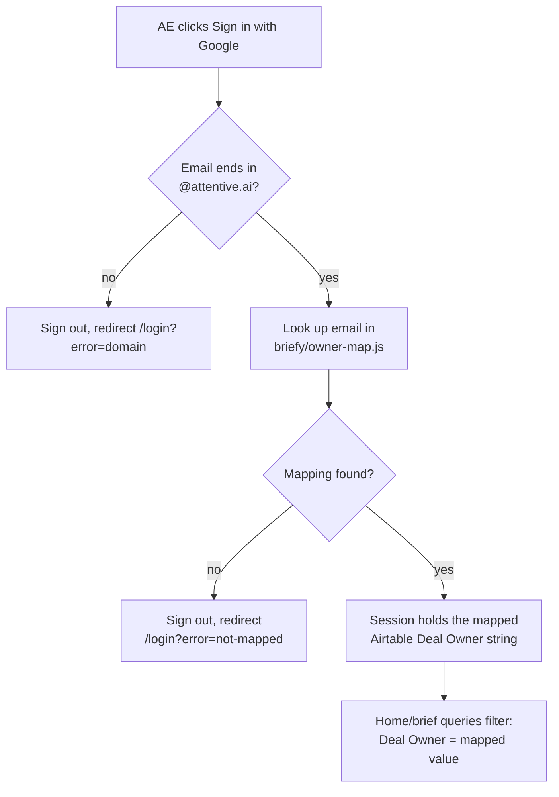

# Briefy — Architecture (Final)

> Supersedes `docs/briefy/architecture.md`, which was written on incorrect assumptions
> (Supabase/Postgres, a rebuilt HubSpot SDK client) and should be treated as void — this
> is the only architecture doc that reflects real decisions. Designed and approved
> 2026-07-16, updated same day with the "no new HubSpot workflow — seed from ICP Match
> Final" decision, which in turn made the originally-designed multi-company tiebreak
> logic moot and it was removed (see "Company domain normalization" below) — Company
> Domain is now always a single value copied from ICP Match Final, which already
> excludes personal-email domains in its own upstream pipeline.

## Data source: seeded from ICP Match Final, no new HubSpot workflow

Earlier drafts of this spec assumed a brand-new HubSpot→Airtable workflow would need
to be built to create Briefy's initial rows. **That's no longer the plan.** ICP Match
already has a working HubSpot→Airtable pipeline that creates and enriches a row in
"ICP Match Final" (the existing table, existing base) every time a relevant HubSpot
deal is created. Rather than duplicating that pipeline, Briefy's engine reads its seed
data directly from "ICP Match Final" and only writes its own research into the new,
separate Briefy base.

**What you're adding to "ICP Match Final" yourself** (not built by this codebase):
`Deal Owner`, `Deal Stage`, `Deal Link` — three new fields on the existing table,
populated however your existing HubSpot workflow/process populates the rest of that
row. Everything else Briefy needs (`Deal Name`, `Company Name`, `Company domain`,
`IP State`, `IP Country`, `Meeting Date & Time`, `Exa Content`, `Pages Scraped`,
`Trade Category`, `Enriched At`, `Deal ID`) already exists there today.

**What the engine does with it** (`briefy/syncFromIcpMatch.js`, new — see Repo
layout): on every tick, before the usual resolve-and-build cycle, it polls "ICP Match
Final" (same base, default `AIRTABLE_API_KEY`/`AIRTABLE_BASE_ID` — no new credentials
needed) for rows where `Deal Owner` is set **and** `Enriched At` is set (i.e. ICP
Match's own scrape/classification has actually finished — picking up earlier would
seed Briefy's row with blank `Exa Content`/`Trade Category`). For each such row not
yet mirrored into the Briefy base (matched by `Deal ID`), it creates a new Briefy row,
copying over the fields listed above plus setting `Brief Status = "Not Started"`. From
there, the existing resolve → six-sections → write cycle runs exactly as designed
below, unchanged.

This also means `overview.js` (Milestone 4) should **prefer the already-copied `Exa
Content`** over re-scraping from scratch when it's non-empty — ICP Match already paid
the Exa/Firecrawl cost for this domain, no reason to pay it twice. Falls back to a
fresh scrape only if `Exa Content` is empty.

**Field-name caveat**: `IP State`, `IP Country`, and `Meeting Date & Time` were not in
this doc's original "ICP Match Final" schema summary (which came from README.md, not
a live schema pull) — confirmed by you to exist live, with `Meeting Date & Time`
returned by the Airtable API as a raw epoch-millisecond number (e.g.
`1782830700000`), not an ISO date string, implying it's a Number field, not a native
Airtable Date field. Briefy's copy of this field is typed identically (Number,
integer) to avoid a lossy/failed conversion on write — display formatting is a
frontend concern, out of scope for this backend plan. Since I can't independently read
your live Airtable schema, verify these three field names character-for-character
before running Milestone 2's setup script.

## What Briefy is

Briefy is a pre-call briefing agent for Account Executives (AEs). When a meeting is
booked, a HubSpot deal exists (upstream, not Briefy's job). Once a Briefy Airtable row
is created for that deal, Briefy researches the company behind it — website, org
chart, revenue, hiring activity, buying intent, HubSpot engagement history — and has a
full brief ready before the AE opens the app.

It's a second product inside the existing **ICP Match** repo, sharing that repo's
working API clients (HubSpot, ZoomInfo, Exa/Firecrawl/SerpAPI scraping, the Requesty
LLM gateway) instead of rebuilding them. **ICP Match keeps running unmodified
throughout** — the only changes to its existing files are import-path updates when
shared logic moves into `src/lib/` (see below), with no behavior change.

Each AE sees only briefs for deals where Airtable's `Deal Owner` matches them.

## Company domain normalization

Earlier drafts of this spec assumed Briefy might need to disambiguate between two
HubSpot companies associated with a deal (a comma-separated pair of domains, with an
Exa-scrape tiebreak if both looked legitimate). **That logic has been removed.** Now
that `Company Domain` is seeded directly from "ICP Match Final"'s `Company domain`
field, it is always a single, already-resolved value — ICP Match's own pipeline works
one domain per row, and personal-email domains never reach the `Enriched At` stage in
the first place (ICP Match's existing "Personal Email" check skips them upstream,
before scraping ever runs). There is no remaining scenario where Briefy would receive
two candidate domains for one row.

`briefy/resolveCompany.js` is now a small, synchronous normalization step —
trim/lowercase the domain, strip a leading `http(s)://` or `www.` if present, treat a
blank result as "not found" — with no async work, no Exa probing, and no
`GENERIC_EMAIL_DOMAINS` dependency. Every `sections/*.js` function takes a **single
domain string**, not a list — the "list of resolved companies" abstraction from
earlier drafts added complexity (merging text across companies, JSON array merging,
per-company fan-out) with no remaining case that exercises it, so it's gone too.

## Prior deals resolution

"Prior deals for the same company" is resolved via the **person who booked the demo**,
not the company record. No primary/secondary contact distinction — just the contact
associated with the deal:

1. `lib/hubspot.js#getDealContact(dealId)` gets the contact associated with the deal.
2. `lib/hubspot.js#getDealsForContact(contactId, excludeDealId)` searches
   `/crm/v3/objects/deals/search` filtered on `associations.contact = contactId`
   (the same pattern `findDealIdByDomain` already uses in production, just scoped to
   one contact instead of a domain-wide contact list), excluding the current deal.
3. If **more than one** prior deal comes back, all of them are listed — no attempt to
   pick a "most relevant" one. For each: `dealName`, `dealOwner` (resolved from
   `hubspot_owner_id` via a cached owners lookup, `getOwnerName`), `dealLink` (built
   from the confirmed portal ID: `https://app.hubspot.com/contacts/20155995/deal/{id}`),
   and `meetingDateTimeSales` (that prior deal's own `meeting_date___time___sales`
   value, so the AE can see when it was for).
4. Written to the `Prior Deals` field as a JSON list — empty list if none found.

## Confirmed vs. inferred vs. pending — read before implementing

**Confirmed live** (verified against the real Attentive.ai HubSpot account during
design, via the HubSpot MCP connector):
- `meeting_date___time___sales` deal property exists exactly as named. (A separate
  `meeting_date___time___final` also exists — not what we use.)
- `dealstage`, `hubspot_owner_id` (label "Deal owner") exist on deals as expected.
- `hs_analytics_last_url` ("Last Page Seen") + `hs_analytics_last_timestamp` — these
  live on **contacts**, not deals. This is the "last page visited before booking"
  signal referenced in the spec.
- Company object: `domain`, `revenue`, `annualrevenue`, `hs_revenue_range`, `industry`,
  `linkedin_company_page` all exist.
- `search_owners`-equivalent HubSpot lookup returns owner `name` + `isActive`, but
  **not email** — confirms there is no reliable way to auto-resolve a Google-login
  email to a HubSpot owner via this API surface. The static config mapping (below) is
  not a fallback, it's the only workable approach given this constraint.
- Existing `src/hubspot.js` is a hand-rolled `fetch()` client (rate-limit retry, legacy
  `hapikey` support, 3-tier deal resolution in `findDealIdByDomain`). It is **extended
  with new functions**, not replaced with an SDK — no migration risk to ICP Match.
- **Confirmed by you**: `Company Domain` is always a single value once seeded from
  "ICP Match Final" — the originally-designed multi-company tiebreak logic (a HubSpot
  deal could in principle carry two associated Company records) was removed as moot
  under this data source. See "Company domain normalization" above.

**Confirmed live, continued**:
- **Prior deals now resolve via the contact associated with the deal, not its
  company** — no primary/secondary contact distinction, just whichever contact is on
  the deal. `associations.contact` deal search (`/crm/v3/objects/deals/search` filtered on
  `associations.contact`) is already exercised in production inside
  `findDealIdByDomain` — reusing that exact pattern for one specific contact ID instead
  of a domain-wide contact list is a much lower-risk reuse than the company-association
  approach this replaced.

**Inferred, needs verification against live accounts before/while building**:
- ZoomInfo Contact **Search** endpoint path/params — likely `POST
  https://api.zoominfo.com/gtm/data/v1/contacts/search`, following the same shape as
  the already-integrated `enrich` endpoints, but not confirmed from public docs.
- ZoomInfo Intent Enrich: `POST https://api.zoominfo.com/gtm/data/v1/intent/enrich` —
  per public ZoomInfo docs. **Confirmed by you**: the account has Intent access; topic
  IDs to follow separately.
- Clay's integration shape — Clay's public integration model is table-based
  (webhook-in to add a row, webhook-out / native action to deliver results), not a
  fixed synchronous REST endpoint you call per-domain. You have a working (trial-tier)
  API key, so the exact request/response shape for the async trigger needs a short
  live-testing pass against your actual account before `src/lib/clay.js` is finalized —
  the interface below is built to be provider-shape-agnostic so that pass doesn't
  ripple into the rest of the codebase.

**Explicitly pending your input**:
- `ZOOMINFO_INTENT_TOPICS` — the topic IDs your plan should target (you'll share
  these).
- Clay account specifics once you're testing for real: webhook URL(s), table/field
  setup, payload shape.
- The `config/owner-map.js` email → Deal Owner mapping (see Auth below) — this file
  ships with a placeholder and must be filled in by you before login works for anyone.
- **Adding `Deal Owner`, `Deal Stage`, `Deal Link` to "ICP Match Final"**: you're
  handling this yourself (field creation + however they get populated). Briefy's sync
  step (`syncFromIcpMatch.js`) does nothing useful until these three fields exist and
  are populated on rows you want mirrored into Briefy.
- **Exact field names on "ICP Match Final"**: `IP State`, `IP Country`, and `Meeting
  Date & Time` are confirmed by you to exist but weren't independently verified by me
  against the live base (see the field-name caveat above) — double-check exact
  spelling/casing before Milestone 2's setup script runs, since Airtable field access
  is exact-match.

## System overview

```mermaid
flowchart LR
    ICPHS[Existing HubSpot workflow\nalready built, not part of Briefy]
    ICPAT[(Airtable\n"ICP Match Final"\nexisting table + base)]
    ICPPIPE[icp-final.js / watch.js\nexisting, unmodified]
    SYNC[briefy/syncFromIcpMatch.js\npolls ICP Match Final for\nDeal Owner + Enriched At set]
    AT[(Airtable\n"Briefy" table\nSEPARATE base)]
    ENGINE[briefy/engine.js\npolls Briefy base, mirrors watch.js]
    RESOLVE[briefy/resolveCompany.js\ndomain normalization only]
    BUILD[briefy/briefBuilder.js\nper-row research orchestrator]
    HS[(HubSpot API\nvia lib/hubspot.js)]
    ZI[ZoomInfo GTM API\nvia lib/zoominfo.js]
    SCRAPE[Exa / Firecrawl / SerpAPI\nvia lib/scrapers.js]
    LLM[Requesty gateway\nvia lib/requesty.js]
    CLAY[Clay\nvia lib/clay.js - async]
    WEB[web/ - Next.js\nUI + API routes]
    AE((AE))

    ICPHS -- new deal --> ICPAT
    ICPPIPE -- scrape + classify\n(unchanged) --> ICPAT
    SYNC -- read: Deal Owner set\n+ Enriched At set --> ICPAT
    SYNC -- create new row\n(seed fields copied) --> AT
    ENGINE -- poll: Brief Status\nin Not Started/Refreshing --> AT
    ENGINE --> RESOLVE
    RESOLVE -- resolved domain --> BUILD
    BUILD -- org tree, revenue, intent --> ZI
    BUILD -- overview, portfolio, hiring\n(prefers copied Exa Content) --> SCRAPE
    BUILD -- prior deals, last page visited --> HS
    BUILD -- synthesize --> LLM
    BUILD -- trigger (fire-and-forget) --> CLAY
    CLAY -- async webhook callback --> WEB
    BUILD -- write sections + Section Status --> AT
    AE -- Google SSO (@attentive.ai) --> WEB
    WEB -- read/refresh briefs --> AT
    WEB -- verify owner via config/owner-map.js --> WEB
```

## Repo layout

```
src/
  lib/                          shared, used by BOTH products
    hubspot.js                   MOVED from src/hubspot.js. Existing functions
                                  (hubspotRequest, updateDeal, getDeal,
                                  findDealIdByDomain, searchDealByName) untouched.
                                  NEW: getDealContact(dealId) to get the contact
                                  associated with the deal (no primary/secondary
                                  distinction); getDealsForContact(contactId,
                                  excludeDealId) for prior deals (reuses the same
                                  associations.contact search pattern already proven
                                  in findDealIdByDomain, just scoped to one contact);
                                  getContactAnalytics(contactId) for
                                  hs_analytics_last_url/_timestamp; getOwnerName
                                  (ownerId) (caches the owners list once per engine
                                  tick) to resolve prior deals' owner names.
                                  (GENERIC_EMAIL_DOMAINS was exported for a now-removed
                                  resolveCompany.js free-domain filter — see "Company
                                  domain normalization"; left exported since nothing
                                  else broke by keeping it.)
    zoominfo.js                   MOVED from src/zoominfo.js. Existing
                                  enrichCompanyByDomain/enrichBatch untouched.
                                  NEW: searchContacts(domain, titles[]),
                                  enrichIntent(domain, topics[]).
    airtable.js                   MOVED from src/airtable.js. NEW: createBase(baseId)
                                  factory, so getRecords/createRecord/updateRecord can
                                  target either ICP Match's base (default, unchanged
                                  call sites) or Briefy's separate base
                                  (BRIEFY_AIRTABLE_BASE_ID) explicitly.
    scrapers.js                   NEW. exaScrape/firecrawlScrape/serpFallback EXTRACTED
                                  byte-identical out of icp-final.js (currently inlined
                                  there and duplicated in run-test-table.js) so both
                                  products import one copy.
    requesty.js                   NEW. Thin wrapper around the
                                  router.requesty.ai/v1/chat/completions call, currently
                                  duplicated inline in icp-final.js/exa-classify.js/
                                  classify-all.js.
    clay.js                       NEW. triggerEnrichment(domain, dealId) fires the async
                                  request; stubs to a no-op returning
                                  { status: 'not_configured' } if CLAY_API_KEY is unset.

  icp-final.js, watch.js,        UNCHANGED behavior. Only change: import scraping fns
  push-to-hubspot.js,             from lib/scrapers.js and the LLM call from
  run-test-table.js, ...         lib/requesty.js instead of their own inlined copies.

  briefy/                        NEW, all Briefy backend code
    syncFromIcpMatch.js            NEW. Reads "ICP Match Final" (default/ICP Match
                                   base — no new credentials) for rows with Deal Owner
                                   and Enriched At both set, not yet mirrored (matched
                                   by Deal ID) into the Briefy base; creates a new
                                   Briefy row per such row, copying the seed fields and
                                   setting Brief Status = "Not Started". Runs first in
                                   engine.js's tick, before the usual poll.
    engine.js                     Airtable-polling loop — same shape as watch.js
                                   (poll interval via BRIEFY_WATCH_INTERVAL_MIN; calls
                                   syncFromIcpMatch.js first, then briefBuilder per
                                   pending Briefy row)
    resolveCompany.js              NEW. Synchronous domain normalization only —
                                   trim/lowercase, strip protocol/www, blank -> "not
                                   found". No async work, no Exa probing (see "Company
                                   domain normalization").
    briefBuilder.js                 calls resolveCompany.js first, then runs all 6
                                   sections concurrently against the single resolved
                                   domain, writing Section Status independently
    sections/
      overview.js                   company overview + portfolio (own-site only,
                                     never Google for portfolio). Prefers the already-
                                     copied Exa Content field (from ICP Match) when
                                     non-empty; falls back to lib/scrapers.js for a
                                     fresh scrape only if it's empty. Synthesizes via
                                     lib/requesty.js either way.
      orgTree.js                    ZoomInfo contact search, filtered to estimators /
                                     program managers / upper management
      revenue.js                    ZoomInfo revenue (sync) + Clay revenue (async
                                     trigger; field stays "pending" until webhook lands)
      hubspotSignals.js             last page visited (contact analytics) + prior
                                     deals — both derived from the contact associated
                                     with the deal (the person who booked this demo),
                                     not the company/domain; no primary/secondary
                                     distinction
      hiringSignals.js              careers page (via scrapers.js) + general SerpAPI
                                     query + site:linkedin.com/jobs via SerpAPI
      intent.js                     ZoomInfo Intent Enrich
    owner-map.js                   PLACEHOLDER — email -> exact Airtable "Deal Owner"
                                   string. You fill this in; login fails closed
                                   (access denied, not silently mismatched) for any
                                   email not present.

web/                             NEW Next.js app (App Router), one deploy = UI + API
  app/
    login/                         Google SSO entry, @attentive.ai domain gate
    page.tsx                       Home: today's/upcoming meetings, per-AE timezone
    brief/[domain]/page.tsx        Brief detail page
    api/briefs/[id]/refresh/route.ts   sets Brief Status = "Refreshing"
    api/webhooks/clay/route.ts     Clay async callback -> writes Clay Revenue to Airtable
  lib/airtable.ts                 server-only Airtable read/write helpers for the UI
  auth.ts                         NextAuth Google provider + owner-map check
  components/
```

## Airtable schema — new "Briefy" table, in a completely separate Airtable base

Briefy gets its **own Airtable base** (`BRIEFY_AIRTABLE_BASE_ID`), not just a separate
table inside ICP Match's existing base — no shared base, no risk of touching "ICP
Match Final" or any of its schema. `src/lib/airtable.js` is generalized to connect to
either base (see Repo layout below); ICP Match's own calls are unaffected and keep
using its existing base by default.

**Seed fields** (copied by `syncFromIcpMatch.js` from "ICP Match Final" the moment a
row there has `Deal Owner` + `Enriched At` both set — see "Data source" above):

| Field | Type | Copied from "ICP Match Final" |
|---|---|---|
| `Deal ID` | Text | `Deal ID` — the match key used to detect "already mirrored" |
| `Deal Name` | Text | `Deal Name` |
| `Company Name` | Text | `Company Name` |
| `Company Domain` | Text | `Company domain`. Always a single, already-resolved domain — ICP Match works one domain per row, and `resolveCompany.js` only normalizes it (trim/lowercase/strip protocol), it doesn't disambiguate between multiple candidates (that logic was removed — see "Company domain normalization"). |
| `IP State` | Text | `IP State` (ZoomInfo location data) |
| `IP Country` | Text | `IP Country` (ZoomInfo location data) |
| `Meeting Date & Time` | Number (integer) | `Meeting Date & Time` — copied as the same raw epoch-millisecond value, not reformatted (see field-name caveat above) |
| `Exa Content` | Long text | `Exa Content` — ICP Match's raw scraped website text; `overview.js` prefers this over a fresh scrape |
| `Pages Scraped` | Long text | `Pages Scraped` |
| `Trade Category` | Text | `Trade Category` |
| `ICP Enriched At` | DateTime | `Enriched At` — renamed on the Briefy side to avoid colliding with Briefy's own `Last Enriched At` below |
| `Deal Owner` | Text | `Deal Owner` — you're adding this field to "ICP Match Final" yourself |
| `Deal Stage` | Text | `Deal Stage` — you're adding this field to "ICP Match Final" yourself |
| `Deal Link` | URL | `Deal Link` — you're adding this field to "ICP Match Final" yourself |

**Engine-owned fields**:

| Field | Type | Notes |
|---|---|---|
| `Brief Status` | Single select | `Not Started` / `Generating` / `Ready` / `Error` / `Refreshing` |
| `Section Status` | Long text (JSON) | `{"overview":"ready","portfolio":"ready","orgTree":"ready","revenue":"pending","hubspotSignals":"ready","hiringSignals":"ready","intent":"ready"}` — lets the UI render per-section loading/error state without 7 separate status columns |
| `Last Enriched At` | DateTime | |

**Research output fields**:

| Field | Type |
|---|---|
| `Company Overview` | Long text |
| `Portfolio / Projects` | Long text (links from the company's own site only) |
| `Org Tree` | Long text (JSON: `{estimators:[], programManagers:[], upperManagement:[]}`, each `{name,title,phone,email,source}`) |
| `ZoomInfo Revenue` | Text |
| `Clay Revenue` | Text |
| `Last Page Visited` | Text |
| `Last Page Visited At` | DateTime |
| `Prior Deals` | Long text (JSON list: `{dealName, dealOwner, dealLink, meetingDateTimeSales}` — one entry per other deal found for the same contact, i.e. the person who booked this demo, excluding the current deal) |
| `Open Roles` | Long text (JSON list: `{title, source, link}`) |
| `ZoomInfo Intent Score` | Text |

## Auth flow



- The Google `hd` param is a UI hint only; the `@attentive.ai` check happens
  server-side and is the authoritative gate.
- `owner-map.js` ships with the mapping empty/placeholder — **you fill it in** with
  real `{email: "Deal Owner string"}` pairs before anyone but you can log in.
- The frontend never holds `AIRTABLE_API_KEY` or `HUBSPOT_API_KEY` — Next.js
  server-side code (API routes / server components) is the only thing that touches
  either.

## Engine + refresh mechanics

- **Sync, then poll**: every `BRIEFY_WATCH_INTERVAL_MIN` minutes (default 5, mirrors
  `watch.js`'s `WATCH_INTERVAL_MIN` pattern), `syncFromIcpMatch.js` runs first —
  mirroring any newly-eligible "ICP Match Final" rows into the Briefy base — then the
  engine queries the Briefy base for rows where `Brief Status` is `Not Started` or
  `Refreshing`, same as before.
- **Resolve, then build**: `resolveCompany.js` normalizes the domain first per row,
  then `briefBuilder.js` fans out sections against it.
- **On-demand refresh**: the Next.js `api/briefs/[id]/refresh` route only flips
  `Brief Status` to `Refreshing` — it never talks to the engine process directly.
  The engine picks it up on its next poll. This keeps "Airtable is the trigger" true
  for refreshes too, and means the web app and engine never need to know about each
  other beyond the shared Airtable base.
- **Clay is async and fire-and-forget**: `briefBuilder.js` calls
  `lib/clay.js#triggerEnrichment` and moves on without waiting; `revenue.js` writes
  `Clay Revenue` as `pending` in `Section Status` until the webhook callback (handled
  by the Next.js app, not the engine) lands and updates the Airtable row directly.

## Frontend

**Home**: list of cards for today's/upcoming meetings — company, meeting time (in the
AE's own timezone, auto-detected with a settings override), stage, deal name. Each
card shows a small status indicator (ready / generating / a muted note if a section is
still pending).

**Brief detail page**: one page per row —
Overview · Portfolio/Projects · Org Tree (phones/emails) · Revenue (ZoomInfo | Clay) ·
Last Page Visited · Prior Deals · Open Roles · ZoomInfo Intent Score. Each section
renders its own loading/error/empty state independently from `Section Status` — a
brief is never all-or-nothing. A refresh action is available per brief.

**Visual style**: clean and minimal — generous whitespace, restrained neutral palette,
clear typography, strong hierarchy, scannable in the two minutes before a call. No
gratuitous color, no clutter.

**Stack**: Next.js (App Router) + Tailwind + shadcn/ui.

## Hosting

Everything on Railway — no other hosting provider involved. Next.js doesn't require
Vercel; `next start` is just a regular long-running Node server, which is exactly what
Railway already runs for ICP Match's `watch.js`. Two services in the same Railway
project:

- `web/` (Next.js, UI + API routes) — a Railway service running `next build && next
  start`, given a Railway-provided public domain (or a custom one).
- `src/briefy/engine.js` (Airtable-polling daemon) — a second always-on Railway
  service, alongside the existing ICP Match `watch.js` service. Same pattern, separate
  process, same project.

## Error handling

- **Engine tick failures** (HubSpot/ZoomInfo/Airtable rate-limited or down): logged and
  retried next cycle — same pattern as `watch.js`; a bad tick never crashes the
  process.
- **Resolution failures**: a blank/unusable `Company Domain` (e.g. the seed field was
  empty) leaves the row in `Error` status rather than guessing at a domain — same as
  any other section failure.
- **Section failures**: each section writes its own `error` entry into `Section
  Status` independently; the rest of the brief is unaffected.
- **Clay silence**: if no callback arrives within a configurable window (default 24h),
  `revenue.js`'s Clay entry flips from `pending` to `unavailable` instead of waiting
  forever.
- **Auth edge cases**: an unmapped email is a distinct "you're not set up in Briefy
  yet" message, not a generic login failure.

## New environment variables (to be added to `.env.example`)

```env
# ── Briefy Airtable ───────────────────────────────────────────────────────────
BRIEFY_AIRTABLE_BASE_ID=app...           # a NEW, separate Airtable base — never ICP Match's base
BRIEFY_AIRTABLE_TABLE=Briefy            # table name within that new base

# ── Google OAuth (NextAuth) ───────────────────────────────────────────────────
GOOGLE_CLIENT_ID=...
GOOGLE_CLIENT_SECRET=...
NEXTAUTH_SECRET=...
NEXTAUTH_URL=...                        # e.g. https://briefy.yourdomain.com

# ── Clay ───────────────────────────────────────────────────────────────────────
CLAY_API_KEY=...
CLAY_WEBHOOK_URL=...                    # per-table trigger URL from your Clay account

# ── ZoomInfo Intent ────────────────────────────────────────────────────────────
ZOOMINFO_INTENT_TOPICS=...              # comma-separated topic IDs (you'll supply)

# ── Engine ─────────────────────────────────────────────────────────────────────
BRIEFY_WATCH_INTERVAL_MIN=5
```

## What happens next (in order)

1. **Repo trim**: go through `src/` and remove one-off/legacy scripts not needed by
   either product (candidates to evaluate: `automation.js`, `build-icp.js`,
   `classify-all.js`, `cleanup.js`, `fix-datasource-15.js`, `icp-scorer.js`,
   `rerun-gemini.mjs`, `research-reviews.js`, `scrape-classify.js` — none of these are
   wired into `package.json` scripts today, but each needs a quick read before removal
   in case something still depends on it).
2. **README rewrite**: document ICP Match as-is (trimmed) plus a full Briefy section.
3. **Implementation plan**: hand this spec to the writing-plans process for a
   step-by-step build plan, starting with the `src/lib/` extraction (since ICP Match
   safety depends on that being done and verified first).
