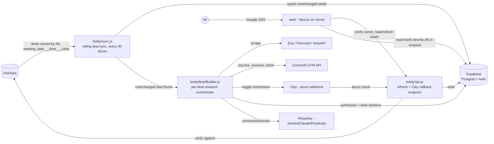
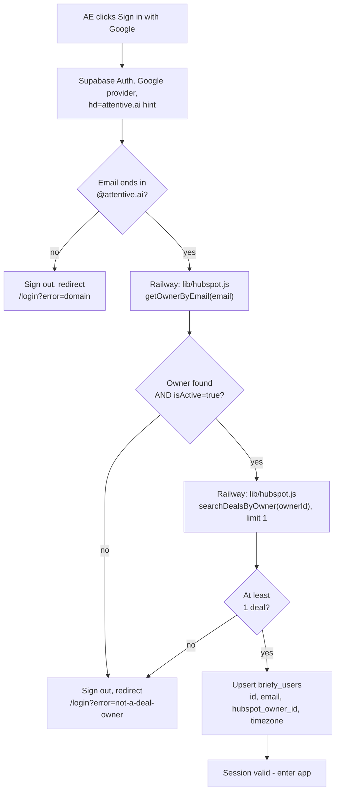

# Briefy — Architecture

> **Status: design complete, pending final written spec.** All sections below are
> designed and approved through brainstorming. Next step is the formal spec doc and
> sign-off before implementation planning begins.

## What Briefy is

Briefy is a pre-call briefing agent for Account Executives (AEs). It doesn't read the
AE's calendar — it reads HubSpot directly. It finds every deal an AE owns with a
meeting scheduled, researches the company behind that deal (website, org chart,
revenue, hiring activity, buying intent, HubSpot engagement history), and has a full
brief ready and waiting before the AE ever opens the app.

It's built as a second product inside the existing **ICP Match** repo, sharing that
repo's working API clients (HubSpot, ZoomInfo, Exa/Firecrawl/SerpAPI scraping, the
Requesty LLM gateway) instead of rebuilding them. ICP Match keeps running unmodified
throughout.

## System overview



## Repo layout

```
src/
  lib/                          <- shared clients, used by BOTH products
    hubspot.js                   REBUILT on @hubspot/api-client SDK (was hand-rolled
                                  fetch()). Also used by ICP Match's push-to-hubspot.js
                                  -> highest-risk migration in this project, needs
                                  equivalence testing (rate-limit retry, legacy hapikey
                                  support, 3-tier deal resolution) before ICP Match can
                                  be considered safe post-migration.
    zoominfo.js                  existing, reused as-is + new enrichIntent() and
                                  contact search/enrich functions added
    airtable.js                  existing, untouched - ICP Match keeps using it
    scrapers.js                  NEW: exaScrape/firecrawlScrape/serpFallback EXTRACTED
                                  out of icp-final.js, byte-identical logic just moved
                                  so both products import one copy instead of two
                                  drifting copies (icp-final.js and run-test-table.js
                                  currently each have their own inlined copy)
    requesty.js                  NEW: thin wrapper around the Requesty chat-completions
                                  call, currently duplicated inline across icp-final.js/
                                  exa-classify.js/classify-all.js
    clay.js                      NEW: webhook trigger + callback verification, stubs
                                  cleanly when CLAY_API_KEY/CLAY_WEBHOOK_URL are unset

  icp-final.js, watch.js, ...   EXISTING, only change: import scraping fns from
                                 lib/scrapers.js instead of inlined copies. No behavior
                                 change otherwise.

  briefy/                        NEW, all Briefy backend code
    sync.js                       rolling HubSpot deal sync (every 30-60min)
    api.js                        Express API: on-demand refresh, Clay webhook receiver,
                                   owner-verification endpoint for auth
    auth.js                       Google email -> HubSpot owner verification logic
    briefBuilder.js                orchestrates one company's brief across all sections
    sections/
      overview.js                  company overview + portfolio (own-site only)
      orgTree.js                   ZoomInfo (+ later Clay) org tree
      revenue.js                   ZoomInfo revenue + Clay revenue (async)
      hubspotSignals.js            last page visited + prior deals
      hiringSignals.js              careers page + SerpAPI + LinkedIn-via-SerpAPI
      intent.js                    ZoomInfo Intent score

web/                             NEW, Next.js frontend (deployed to Vercel)
  app/
    login/, page.tsx (home), brief/[id]/page.tsx, settings/page.tsx
  components/
  lib/                            Supabase client helpers

supabase/
  migrations/                    SQL schema, see below
```

## Data model (Supabase Postgres)

```sql
briefy_users          (id, email, hubspot_owner_id, timezone, created_at)

briefs                (id, hubspot_deal_id, hubspot_company_id, company_domain,
                        ae_user_id -> briefy_users, meeting_at, status,
                        created_at, generated_at)

brief_org_tree_people (brief_id, name, title, phone, email, category, source)

brief_sections        (brief_id, section_type, content jsonb, status, updated_at)
                       -- one row per section: overview, portfolio, revenue,
                       -- hubspot_signals, hiring_signals, intent
```

`brief_sections` is a flexible per-section table (not one wide `briefs` row) so a
slow/async piece — Clay revenue, in particular — can sit at `status: 'pending'` and
update independently without blocking the rest of the brief from rendering.
`brief_org_tree_people` is a proper relational table (not JSON) since the org tree
needs to be queryable by name/title/phone/email.

**Security**: Supabase RLS policies scope every table so an AE can only read their own
`briefs` (and children, via join) — `ae_user_id = auth.uid()`. The backend (sync job,
API) connects with the Supabase service-role key, which bypasses RLS, since it writes
briefs for all AEs.

## Auth flow



Key points:
- The Google `hd` param is a UI hint only, not enforcement — the `@attentive.ai` domain
  check on the server is the authoritative gate.
- "Deal owner" means genuinely owns at least one deal right now, not merely existing as
  an owner record in HubSpot (which includes non-AE roles too) — confirmed via a live
  HubSpot lookup during design that owner records can be `isActive: false` for departed
  staff, so that flag is checked explicitly.
- This full check re-runs on **every login**, not just once, so reassignment/departure
  takes effect immediately without a separate deprovisioning step.
- The frontend never holds `HUBSPOT_API_KEY` — it always calls through the Railway API.

## Continuous sync + brief generation

```mermaid
flowchart TD
    S[sync.js loop, every 30-60min] --> Q[For each AE in briefy_users:\nquery HubSpot deals owned by them,\nmeeting_date___time___sales in\nnow -> +7 days rolling window]
    Q --> N{New deal, or\nmeeting time changed\nsince last sync?}
    N -- no --> S
    N -- yes --> U[Upsert briefs row]
    U --> BB[briefBuilder.buildBrief\nruns all 6 sections concurrently]
    BB --> W[Each section writes its own\nbrief_sections row independently\non completion or error]
    W --> R[briefs.status = ready\nonce sync sections done\n(Clay may still be pending)]

    UI[AE opens app] --> HOME["Home: SELECT * FROM briefs\nWHERE ae_user_id = me\nAND meeting_at (local day) = today"]
    HOME --> DONE[Already populated in almost\nall cases - generation happened\ndays before, not at open-time]
    DONE --> REFRESH{AE clicks Refresh?}
    REFRESH -- yes --> BB
```

Why this shape instead of a single per-AE 8 AM trigger: a meeting booked same-day
*after* an AE's local 8 AM would otherwise wait until the next day's run under a
once-daily model. Continuous syncing means brief generation starts within an hour of a
meeting being booked — which also gives Clay's async webhook far more lead time to
land before the AE ever looks at the brief. The AE's local "8 AM" is now purely a UI
concept (how "today" is bucketed for the home screen), plus one lightweight safety-net
re-sync near each AE's local morning to catch last-minute reschedules the hourly loop
hasn't hit yet.

**Assumption flagged**: "meetings will be in Supabase after some go-live point" is being
read as "full sync of everything currently scheduled on launch, then continuous
incremental sync forever after" — not a literal historical-data import requirement.
Correct me if that's wrong.

## The six research sections

| Section | Primary source(s) | Notes |
|---|---|---|
| Overview + Portfolio | Exa -> Firecrawl -> SerpAPI cascade (`lib/scrapers.js`, reused from ICP Match) + Requesty/Gemini synthesis | Portfolio/project links pulled **only** from the company's own scraped pages, never from Google — if no projects-style page was found, says so rather than inventing one |
| Org Tree | ZoomInfo contact search + enrich (new functions) | Filtered to estimators, program/project managers, upper management. Clay supplements asynchronously once available |
| Revenue | ZoomInfo (`enrichCompanyByDomain`, already available) + Clay (async) | Two separate columns, Clay shows `pending` until its webhook callback lands |
| HubSpot Signals | `hs_analytics_last_url` / `hs_analytics_last_timestamp` on the deal's primary contact; deals associated with the same Company, excluding today's deal | |
| Hiring Signals | Company's own `/careers` page (via scraper reuse) + general SerpAPI query + `site:linkedin.com/jobs` via SerpAPI | No native LinkedIn Jobs API in this stack — LinkedIn coverage is Google-search-based, a real limitation worth knowing |
| Intent | ZoomInfo Intent Enrich | `POST https://api.zoominfo.com/gtm/data/v1/intent/enrich`, confirmed live. Needs `ZOOMINFO_INTENT_TOPICS` env var (topic IDs to be supplied) |

## Confirmed vs. inferred vs. pending — read before implementing

**Confirmed live** (verified against real docs/account during design):
- `meeting_date___time___sales` deal property exists exactly as named
- `hs_analytics_last_url`, `hs_analytics_last_timestamp`, `recent_conversion_event_name` on contacts
- `domain__company_`, `company_website` on deals; `domain`, `revenue`, `industry`, `linkedin_company_page` on companies
- HubSpot account timezone: US/Eastern
- ZoomInfo Intent Enrich: `POST https://api.zoominfo.com/gtm/data/v1/intent/enrich`
- ZoomInfo Contact Enrich: `POST https://api.zoominfo.com/gtm/data/v1/contacts/enrich`
- HubSpot owners list includes inactive (`isActive: false`) records — must be filtered

**Inferred, needs verification against a live key before building against it**:
- ZoomInfo Contact **Search** endpoint path/params (very likely `POST .../contacts/search`, following the same pattern as `intent/search` vs `intent/enrich`, but not confirmed from public docs)
- Clay's exact webhook payload shape — Clay's integration model is confirmed to be async webhook-in/webhook-out (not a synchronous query API) based on public docs, but the specific table/field setup can't be known until the account is provisioned

**Explicitly pending your input**:
- `ZOOMINFO_INTENT_TOPICS` — exact topic IDs your ZoomInfo plan is subscribed to
- Clay account details once purchased (API key, webhook URLs, table schema)

## Frontend

**Home page**: single column of cards, one per meeting today, sorted by time
ascending. Each card: company name, domain, meeting time, deal name, and a small
status indicator (ready / generating / a muted note if Clay hasn't landed yet).
Clicking a card opens its brief detail page. A settings icon leads to the timezone
override page.

**Brief detail page** (the page an AE scans in the 2 minutes before a call — chosen
via mockup comparison during design):

```
┌──────────────────────────────────────────────┐
│ TODAY, 2:00 PM                                │
│ Acme Roofing Co.                              │
│ acmeroofing.com                                │
├──────────────┬──────────────┬─────────────────┤
│ REVENUE      │ INTENT       │ LAST PAGE       │
│ ZI | Clay    │ signalScore  │ /pricing        │
├──────────────┴──────────────┴─────────────────┤
│ Overview                                       │
│ Portfolio / Projects                           │
│ Org Tree                                       │
│ Prior Deals                                    │
│ Open Roles                                     │
└──────────────────────────────────────────────┘
```

A compact stat strip (Revenue, Intent Score, Last Page Visited) sits right under the
header for a true 5-second glance, then the rest stacks in one column below — chosen
over a permanent sidebar (competes for width, felt busier) and over a pure single
long scroll (buries the fastest-to-scan facts at the bottom).

**Visual style**: pure neutral — white background, near-black text, no color except a
single small status dot (e.g. green for "ready"). No serif accents, no dark mode
theming in v1. The most restrained of the three directions compared during design;
chosen deliberately over a "dashboard" look (cool slate + accent blue) and an
"editorial" look (warm paper + serif headline) to keep the emphasis entirely on
content, not styling.

Stack: Next.js (App Router) + Tailwind + shadcn/ui, deployed to Vercel.

## Error handling & testing

**Error handling** (extends the per-section isolation described under "Continuous
sync + brief generation" above):
- **Sync job failures** (HubSpot rate-limited/down): logged and retried next cycle,
  same pattern as the existing `watch.js` — a bad tick never crashes the process.
- **Section failures**: each section already writes its own `error` status
  independently; the rest of the brief is unaffected.
- **Clay silence**: if no callback arrives within a configurable window (e.g. 24h),
  the section flips from `pending` to `unavailable` instead of waiting forever.
- **Auth edge cases**: a HubSpot API failure during login verification (as opposed to
  "genuinely not an owner") shows a distinct "couldn't verify right now, try again"
  message — it's never silently treated as a rejection.
- **Frontend**: every section renders its own empty/loading/error state independently
  (skeleton while `generating`, muted inline message on `error`/`unavailable`) — a
  brief is never an all-or-nothing render.

**Testing strategy** (this repo has no automated tests today):
- **HubSpot SDK migration** (highest-risk piece — touches ICP Match's
  `push-to-hubspot.js`): needs equivalence tests comparing the rebuilt
  `@hubspot/api-client`-based client against the current hand-rolled behavior
  (rate-limit retry, legacy `hapikey` support, 3-tier deal resolution) — a hard gate
  before ICP Match is considered safe post-migration, not something to wave through.
- **Section functions**: each `sections/*.js` function is close to pure (domain/deal
  id in, content JSON out), so each gets unit tests with mocked API responses using
  Node's built-in `node:test` — no new test-framework dependency.
- **Auth flow**: unit tests for the domain check and the owner/active/has-a-deal
  logic against mocked HubSpot responses, including the inactive-owner case
  (confirmed to be real data during design, not hypothetical).
- **Manual verification**: Clay (once provisioned), ZoomInfo Intent (once topics are
  set), and live Google SSO get a manual smoke-test pass during implementation,
  documented in the plan — these can't be unit tested without real credentials.

## Confirmed decisions from visual review

- Brief detail layout: compact stat strip + stacked sections (not sidebar, not one
  long uninterrupted scroll)
- Visual style: pure neutral, near-black on white, minimal color
- Frontend stack: Next.js + Tailwind + shadcn/ui on Vercel
